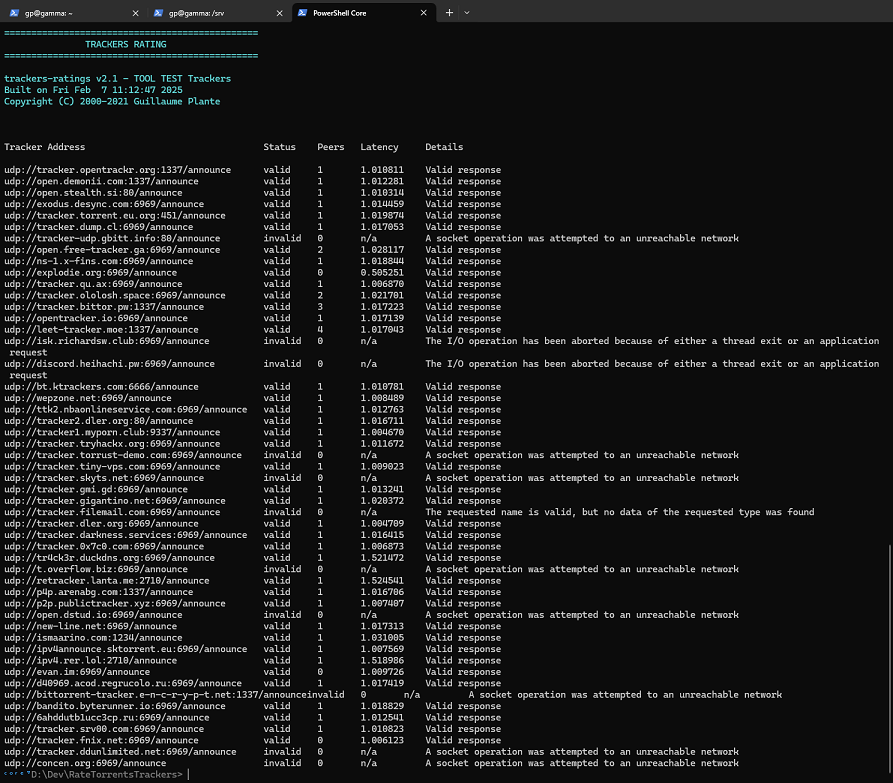
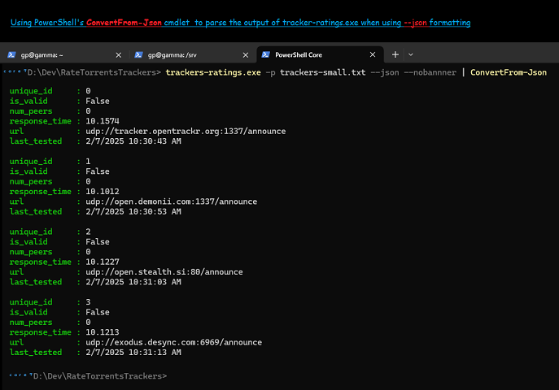
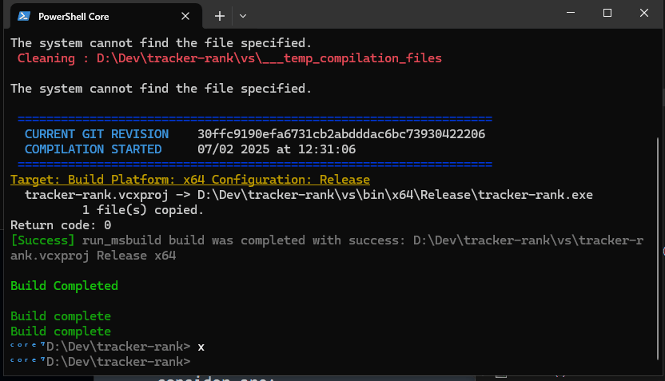

<center></center>

# tracker-rank

A benchmarking tool for torrent trackers and indexers. Scores trackers based on seeders  and latency.

**NOTE** just to be clear, i renamed my project recently so previous screen shots have different app name, Im pretty sure I did the whole  thing but i may have missed a spot.

**NOTE2** just noticed I made this repository public, was going to change it but saw 50 clones in a single day. I'm not to big in making *unprofessional shit I do for fun* public, but considering the interest, i'll leave it public. Some stuff maybe be missing (like Buldautomation) though. If one **really** want other things, send me an email.

## Purpose

So you're like...  WHY? Well, the original idea was to have a way to rank trackers that I use with my [torrents search tool - torrents-tracker](https://github.com/arsscriptum/torrents-tracker) or [here](https://github.com/arsscriptum/torrents-tracker-data) See, when I find torrents and pass them on to the download client (in my case, qbittorrentsvpn), I create a magnet link using trackers that I know. My trackers are in a database, I update them regularly, each time, upgrading the version, so I always create magnet links with latest trackers. **LATEST DOESN'T MEAN GOOD** A good tracker has ++ peers and -- latency. So the purpose here is use this tool to monitor my trackers, and rank them. In my DB i keep trackers and  their scores, so that ***I always use the  BEST ONES***

### Next Steps

This is a prototype, to see if ranking can be done and if I get something out of it. Were we go from here is I'll write a small windows of linux service that will do this in the background. That is:

1. once or twice a day, fetch a list of trackers and make sure I have the latest in  my db.
2. read the trackers in my database and rank them. do this for all versions of trackers, if an old tracker is now  onlne andof good quality, update the version anduse it.
3. have the db  constently updated with ranked trackers.

So when I use the my search tool, thething is **automagically always fast**. that's the theory of course. if I find time, i'll do this. It's a hobby

## The Source... where'd you get the trackers though?

Yeah, initially, I get them from here: [https://cable.ayra.ch/tracker/index.php](https://cable.ayra.ch/tracker/index.php) and (same source) [https://github.com/ngosang/trackerslist](https://github.com/ngosang/trackerslist).

You can run the powershell script [scripts/Get-LatestTrackers.ps1](scripts/Get-LatestTrackers.ps1)

### ***Command-line arguments***

```
    Usage: trackers-ratings [-h][-v][-n][-p] path [-t] tracker
       -v               Verbose mode
       -h               Help
       -n               No banner
       -t               Timeout in seconds
       -j, --json       Json  format
       -i, --indexer    Rate Indexer
       -u, --url        test a single tracker url
       -p, --path       path of the file containing all trackers
```

## Basic Usage

```powershell
  .\scripts\Get-LatestTrackers.ps1 > .\test\trackers-test.txt

  tracker-rank.exe -p test/trackers-test.txt 

    ===============================================
               TRACKERS RATING
    ===============================================

    tracker-rank v2.1 - benchmarking tool for torrent trackers and indexers
    Built on Wed Feb  5 13:58:13 2025
    Copyright (C) 2000-2021 Guillaume Plante

    Tracker Address                             Status    Peers     Latency             Details

    udp://tracker.opentrackr.org:1337/announce  valid     2         1.015604 seconds    Valid response
    udp://open.demonii.com:1337/announce        valid     1         1.007515 seconds    Valid response
    udp://open.stealth.si:80/announce           valid     1         1.014596 seconds    Valid response
```
<center></center>


## Combine with PowerShell cmdlets

```powershell
  tracker-rank.exe -p test/trackers-test.txt --json --nobanner | ConvertFrom-Json

unique_id     : 0
is_valid      : False
num_peers     : 0
response_time : 10.1574
url           : udp://tracker.opentrackr.org:1337/announce
last_tested   : 2/7/2025 10:30:43 AM

unique_id     : 1
is_valid      : False
num_peers     : 0
response_time : 10.1012
url           : udp://open.demonii.com:1337/announce
last_tested   : 2/7/2025 10:30:53 AM

...

```
<center></center>


## How to Build

### Visual Studio

1. Clone [tracker-rank](https://github.com/arsscriptum/tracker-rank)
1. Open and build ```tracker-rank.vcxproj```

### Scripts

If you want to build on the command line, you need some dependencies like [BuildAutomation](https://github.com/arsscriptum/BuildAutomation) and the [DejaInsight](https://github.com/arsscriptum/DejaInsight) projects. You are in luck though! I enjoy automation and I created a script to assist you n setting up the development environment: everything to put a smile on the lazy programmer's face!

1. Create Development Directory, wich contains differents projects in addition to **BuildAutomation**
1. Clone [tracker-rank](https://github.com/arsscriptum/tracker-rank)
1. Setup the development environment using 

```powershell
    $DevelopmentRoot = 'P:\Development'
    # Creating Development Directory
    New-Item -Path $DevelopmentRoot -ItemType Directory -ErrorAction Ignore | Out-Null

    pushd $DevelopmentRoot

    # Clone projects
    git clone --recurse-submodules 'https://github.com/arsscriptum/tracker-rank.git'
 
 	# Configuring the Environment using provided helper script
 	cd 'tracker-rank'
 	. ./Build.ps1

	popd # $DevelopmentRoot
```


<center></center>


## Ranking Formula

**This is mostly theory based on some notes of a statistics class. I need to test and validate.** But first I define that the properties to consider are:

1. Number of Peers (Availability):
   - Why it matters: A high number of peers usually indicates a healthy and popular tracker, which can improve torrent availability and download speed.
   - Drawback: Some trackers may list many peers, but they could be unreliable or slow.

2. Latency (Responsiveness):
   - Why it matters: Low latency means faster communication with the tracker, which can speed up finding peers and starting downloads.
   - Drawback: A low-latency tracker might not provide many peers, limiting its usefulness.

#### THen, maybe

- If Peers are Most Important:
  - Increase `Weight_Peers` (e.g., 0.8) and reduce `Weight_Latency` (e.g., 0.2).
- If Latency is Most Important:
  - Increase `Weight_Latency` (e.g., 0.7) and reduce `Weight_Peers` (e.g., 0.3).


### Weighing the Factors

The relative importance of peers vs. latency will depends our priorities:

#### For Download Speed

Prioritize **number of peers**, as more peers increase the chances of faster downloads.

#### For Real-Time Applications

Prioritize **latency**, as a responsive tracker quickly connects you to peers.

### Quality Score Formula

I can try and calculate a weighted score for each tracker to balance peers and latency

#### Formula

```plaintext
Quality Score = (Weight_Peers * Normalized_Peers) - (Weight_Latency * Normalized_Latency)
```

#### My pseudocode: steps to Compute

1. Normalize Values:
   - Convert peers and latency into a scale of 0 to 1.
     - Normalized Peers = `(Peers - Min_Peers) / (Max_Peers - Min_Peers)`
     - Normalized Latency = `(Latency - Min_Latency) / (Max_Latency - Min_Latency)`

2. Set Weights:
   - Assign weights based on importance:
     - Example: `Weight_Peers = 0.7`, `Weight_Latency = 0.3`.

3. Calculate Score:
   - Use the normalized values and weights in the formula.

**I Implemented a first draft of this in the Get-RatedTrackers.ps1 powershell script**


<center></center>

